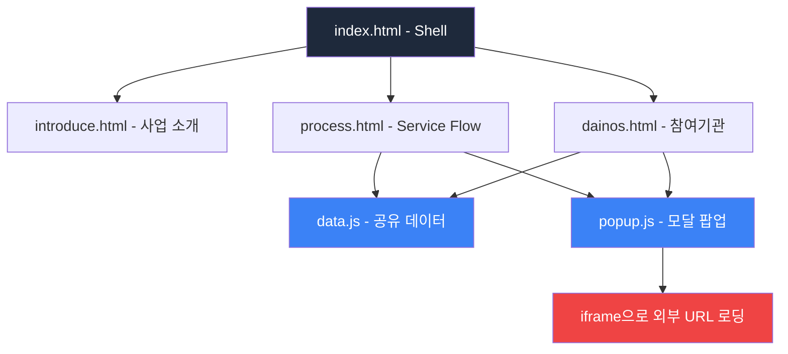
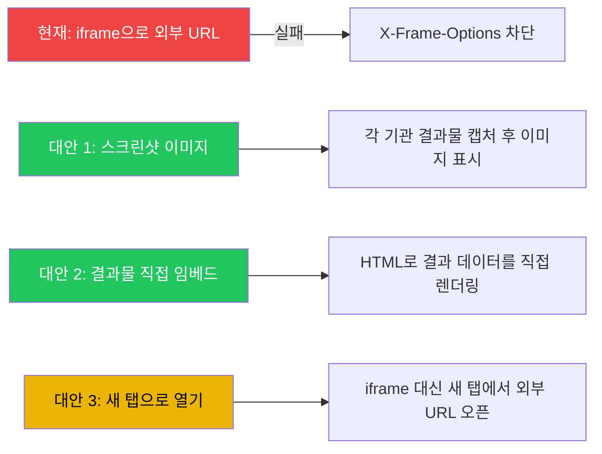

# 🖥️ 초거대 제조AI 3차년도 대시보드 목업 분석

> **분석 대상**: 경남대학교 개발 대시보드 목업 (현재 프로덕션 버전)  
> **목적**: "이 업체의 결과는 이거다" — 참여기관별 결과물 전시용 대시보드  
> **분석 일자**: 2026-03-26

---

## 📐 현재 구조 개요



| 구성요소 | 파일 | 역할 |
|---------|------|------|
| Shell | `index.html` | 다크 사이드바 + iframe 뷰어 |
| 1페이지 | `introduce.html` | 사업 개요, 상세 정보 테이블, 기대효과 |
| 2페이지 | `process.html` | 서비스 플로우 (6단계 횡스크롤) |
| 3페이지 | `dainos.html` | 참여기관 카드 그리드 + DAINOS 필터 |
| 공유 데이터 | `data.js` | 15개 기관 정보 (id, name, role, kpi, status 등) |
| 공유 모달 | `popup.js` | 기관 상세 팝업 (설명 + iframe) |

---

## ✅ 장점 분석

### 1. 깔끔한 소프트 미니멀 디자인
- 라이트 테마 (#F5F6F8 배경)에 부드러운 카드 UI (`soft-card` 클래스)
- `backdrop-blur-xl`, 미묘한 `border-gray-100` 등으로 현대적이고 세련된 느낌
- 과도한 장식 없이 콘텐츠에 집중할 수 있는 구조
- **결과물 전시 목적에 적합** — 정보 전달에 방해가 되지 않는 디자인

### 2. DAINOS 프레임워크 기반 분류 체계
- 참여기관 페이지에서 Data / AI / Infra / Network / Org / Service 6개 도메인으로 필터링
- 사업계획서의 DAINOS 체계와 일관성 유지
- 각 기관에 `type` 배지(주관, 참여, 수요기업 등)로 역할 구분
- **15개 기관을 한눈에 파악 가능**

### 3. 서비스 플로우 시각화
- 6단계 파이프라인을 횡스크롤로 시각화 (데이터 수집 → 전송 → 플랫폼 → AI 분석 → 활용 → 운영관리)
- 각 단계별 참여기관 카드에 상태 표시 (정상/점검/장애)와 KPI 값 포함
- **사업 전체 프로세스를 직관적으로 이해**할 수 있는 레이아웃

### 4. 모듈화된 코드 구조
- `data.js`로 데이터 분리 → 기관 정보 수정 시 한 곳만 변경
- `popup.js`로 팝업 컴포넌트 재사용 → `process.html`과 `dainos.html` 모두 동일 팝업 사용
- Shell + iframe 패턴으로 페이지 독립성 확보
- **유지보수성이 높은 구조**

### 5. 반응형 고려
- Tailwind CSS 유틸리티 클래스 기반으로 `lg:`, `md:` 브레이크포인트 적용
- 모달 팝업이 `w-[90%] h-[90%]`로 화면 크기에 맞게 조정
- 사이드바 접기/펴기 기능 (토글 버튼)

### 6. 상태 관리 시각화
- 각 기관 카드에 `status` 필드 (정상/점검/장애)를 색상으로 구분
- KPI 수치를 카드에 직접 표시하여 한눈에 성과 파악 가능

---

## ⚠️ 단점 분석

### 1. 🔴 치명적: iframe 외부 URL 로딩 실패
- `popup.js`에서 각 기관의 `iframeSrc` (외부 웹사이트 URL)를 iframe으로 로딩
- **대부분의 기업 웹사이트가 `X-Frame-Options` 헤더로 iframe 삽입을 차단**
- 스크린샷에서 확인: DX솔루션즈 팝업에서 "Hmm. We are having trouble finding that site" 오류 표시
- **결과물 전시라는 핵심 목적을 달성하지 못하는 구조적 문제**

```
심각도: ★★★★★ (Critical)
영향: 대시보드의 핵심 기능인 "결과물 보기"가 작동하지 않음
```

### 2. 🟡 실제 결과물 데이터 부재
- 현재 `data.js`의 KPI 값들이 하드코딩된 목업 데이터
- `kpi` 필드: "99.5%", "150ms" 등 — 실제 측정값이 아닌 더미 데이터
- `details` 필드: 1-2줄의 간단한 설명문만 존재
- **3차년도 결과물로 제출하려면 실제 데이터로 교체 필요**

### 3. 🟡 경남대학교 자체 역할 미강조
- 경남대학교는 주관기관이지만, 15개 기관 중 하나로만 표시
- 사업 총괄, 수요기업 연계, 전체 조율 등 주관기관으로서의 역할이 드러나지 않음
- **심사/보고 시 경남대학교의 기여도를 어필하기 어려움**

### 4. 🟡 소개 페이지 정보 부족
- `introduce.html`의 프로젝트 개요가 2-3줄의 간단한 텍스트
- 상세 정보 테이블에 사업 기간, 총 예산, 주요 목표 등은 있으나
- 3차년도만의 차별화된 목표 (MoE 아키텍처, 수요기업 확대 등)가 부각되지 않음
- 기대효과 섹션도 일반적인 내용

### 5. 🟡 내비게이션 한계
- 3개 페이지만 존재 (소개 / 서비스 플로우 / 참여기관)
- **사업 성과 요약 (KPI 대시보드)** 페이지 부재 — `mockUp2.html`에는 존재하지만 프로덕션에는 미포함
- 예산 집행 현황, 일정 진척도 등 관리적 지표 없음

### 6. 🟢 UI/UX 소소한 이슈들
- 서비스 플로우 페이지의 횡스크롤이 직관적이지 않을 수 있음 (스크롤 힌트 부재)
- 카드 hover 효과가 미묘하여 클릭 가능 영역이 명확하지 않음
- 모바일에서의 사이드바 동작이 제한적
- 인쇄/PDF 내보내기 기능 없음 (보고서 제출 시 필요할 수 있음)

---

## 📊 적합성 평가

### 평가 기준: "이 업체의 결과는 이거다"를 보여주는 결과물 전시 대시보드

| 평가 항목 | 점수 | 평가 내용 |
|-----------|------|-----------|
| 디자인 품질 | ⭐⭐⭐⭐ | 깔끔하고 전문적인 소프트 미니멀 디자인 |
| 정보 구조 | ⭐⭐⭐⭐ | DAINOS 기반 분류와 서비스 플로우가 논리적 |
| 결과물 전시 기능 | ⭐⭐ | iframe 실패로 핵심 기능 미작동 |
| 데이터 완성도 | ⭐⭐ | 목업 데이터만 존재, 실제 결과물 미연동 |
| 코드 품질 | ⭐⭐⭐⭐ | 모듈화, Tailwind 활용, 공유 컴포넌트 구조 |
| 확장성 | ⭐⭐⭐ | iframe 패턴으로 페이지 추가 용이하나, 데이터 구조 개선 필요 |
| **종합** | **⭐⭐⭐ (3.0/5)** | 뼈대는 우수하나 핵심 기능에 구조적 문제 존재 |

---

## 🔄 mockUp2.html과의 비교

`mockUp2.html`은 현재 미사용이지만, 프로덕션 버전보다 훨씬 풍부한 콘텐츠를 포함:

| 기능 | 프로덕션 (index.html 셸) | mockUp2.html |
|------|------------------------|--------------|
| 사업 개요 | ⭕ 간단한 소개 | ⭕ KPI 카드 + 타임라인 + WBS |
| 성과 지표 | ❌ 없음 | ⭕ DAINOS 도메인별 KPI 대시보드 |
| 서비스 플로우 | ⭕ 횡스크롤 6단계 | ⭕ 파이프라인 + 상세 카드 |
| 참여기관 | ⭕ 카드 그리드 + 필터 | ⭕ 카드 그리드 + 필터 + KPI |
| 예산 정보 | ❌ 없음 | ⭕ 예산 구성비 차트 |
| 일정 관리 | ❌ 없음 | ⭕ 3개년 타임라인 |
| WBS | ❌ 없음 | ⭕ 13개 항목 테이블 |

> **결론**: `mockUp2.html`의 콘텐츠 구성이 3차년도 결과물 보고에 더 적합하나, 사용자가 말한 "이 업체의 결과는 이거다"라는 단순한 목적에는 현재 프로덕션 버전의 경량 구조가 더 맞을 수 있음. 다만 **성과 지표 페이지**는 추가하는 것을 권장.

---

## 🛠️ 개선 권고사항

### 우선순위 1: iframe 대체 방안 (Critical)

현재 iframe으로 외부 URL을 로딩하는 방식은 작동하지 않으므로 대체 필요:



| 대안 | 장점 | 단점 | 추천도 |
|------|------|------|--------|
| 스크린샷 이미지 | 안정적, 항상 작동 | 수동 업데이트 필요 | ⭐⭐⭐⭐⭐ |
| 결과 데이터 직접 렌더링 | 동적, 상세 표현 가능 | 개발 공수 큼 | ⭐⭐⭐⭐ |
| 새 탭 열기 | 구현 간단 | 대시보드 이탈, UX 저하 | ⭐⭐ |

### 우선순위 2: 결과물 데이터 구조 강화

현재 `data.js`의 각 기관 데이터에 **실제 결과물 정보**를 추가해야 함:

```javascript
// 현재 구조
{
    id: "gnu",
    name: "경남대학교",
    kpi: "99.5%",        // 무슨 KPI인지 불명확
    details: "간단한 설명"  // 너무 짧음
}

// 권장 구조
{
    id: "gnu",
    name: "경남대학교",
    results: {
        title: "초거대 제조AI 통합 플랫폼 구축",
        kpis: [
            { label: "AAS 변환율", value: "99.5%", target: "95%" },
            { label: "API 응답시간", value: "150ms", target: "200ms" }
        ],
        deliverables: [
            "DAINOS 통합 플랫폼 v3.0",
            "MoE 기반 AI 모델 연동 모듈",
            "수요기업 연계 API 게이트웨이"
        ],
        screenshot: "screenshots/gnu_result.png"
    }
}
```

### 우선순위 3: 성과 지표 페이지 추가

`mockUp2.html`의 성과 지표 페이지(page-kpi)를 참고하여, DAINOS 도메인별 KPI를 요약하는 4번째 페이지 추가 권장.

### 우선순위 4: 경남대학교 주관기관 역할 강조

- 소개 페이지에서 주관기관으로서의 총괄 역할 명시
- 또는 별도의 "주관기관 성과 요약" 섹션 추가

### 우선순위 5: 인쇄/내보내기 기능

- 보고서 제출용 PDF 내보내기 또는 인쇄 최적화 CSS 추가

---

## 📋 구현 작업 목록

| # | 작업 | 난이도 | 우선순위 |
|---|------|--------|---------|
| 1 | iframe을 스크린샷 이미지로 대체 | 중 | 🔴 긴급 |
| 2 | `data.js`에 실제 결과물 데이터 구조 추가 | 중 | 🔴 긴급 |
| 3 | 팝업 모달에 결과물 상세 정보 렌더링 | 중 | 🟡 높음 |
| 4 | KPI/성과 지표 페이지 추가 | 상 | 🟡 높음 |
| 5 | 경남대학교 주관기관 역할 강조 섹션 | 하 | 🟢 보통 |
| 6 | 소개 페이지 3차년도 목표 상세화 | 하 | 🟢 보통 |
| 7 | 횡스크롤 UX 힌트 추가 | 하 | 🟢 보통 |
| 8 | 인쇄/PDF 내보내기 지원 | 중 | ⚪ 낮음 |

---

## 🎯 최종 종합 평가

현재 대시보드 목업은 **디자인 품질과 코드 구조 면에서 우수한 기초 작업**입니다. 소프트 미니멀 테마, DAINOS 기반 분류 체계, 서비스 플로우 시각화 등은 잘 설계되어 있습니다.

그러나 **"업체별 결과물을 보여주는" 핵심 목적** 달성을 위해서는:

1. **iframe 외부 URL 방식은 반드시 대체**해야 합니다 (스크린샷 이미지 or 직접 렌더링)
2. **실제 결과물 데이터**를 `data.js`에 구조화하여 추가해야 합니다
3. 팝업 모달의 우측 패널을 결과물 상세 보기로 재설계해야 합니다

이 세 가지만 해결하면, 현재 구조는 "이 업체의 결과는 이거다"를 보여주는 목적에 **충분히 적합한 대시보드**가 될 수 있습니다.
