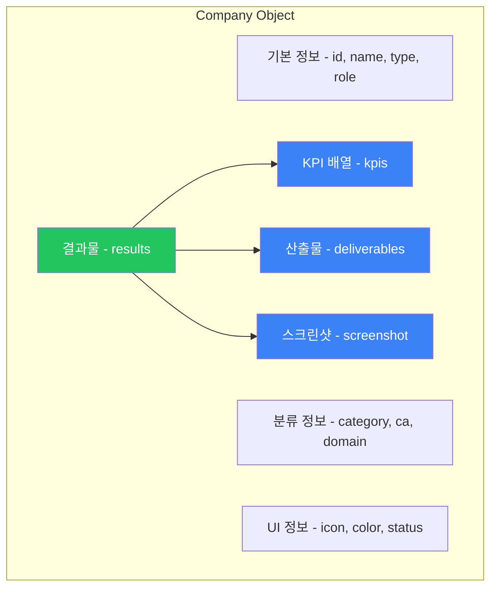
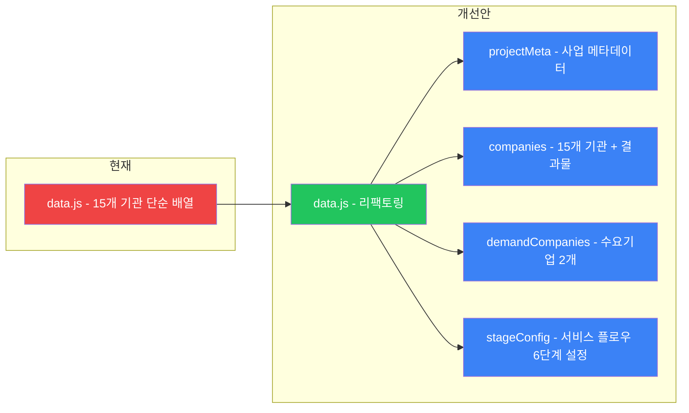

# 📊 data.js 데이터 구조 재설계

> **목적**: "이 업체의 결과는 이거다"를 보여주기 위한 데이터 구조  
> **설계 원칙**: 결과물 중심, iframe 제거, 실증 KPI 포함  
> **설계 일자**: 2026-03-26

---

## 1. 현재 구조 분석

```javascript
// 현재 data.js의 구조 (15개 기관 동일)
{
    id: 'kyungnam',          // 고유 식별자
    type: 'DATA',            // DAINOS 도메인 (DATA/AI/INFRA/NETWORK/ORG/SERVICE)
    name: '경남대학교',        // 기관명
    role: 'Standardization', // 역할 (영문 한 단어)
    desc: '짧은 설명',        // 한 줄 설명
    icon: 'fas fa-...',      // FontAwesome 아이콘
    color: 'blue',           // 테마 색상
    details: '2-3줄 설명',    // 상세 설명 (텍스트만)
    techStack: ['AAS', ...], // 기술 스택 배열
    iframeSrc: 'https://...',// ❌ 외부 URL (대부분 차단됨)
    stage: 3,                // 서비스 플로우 단계 (1-6)
    kpi: "1,204 Models",     // ❌ 단일 KPI 문자열 (무슨 지표인지 불명확)
    status: "normal"         // 상태 (normal/warning/danger)
}
```

### 현재 구조의 문제점

| 문제 | 설명 |
|------|------|
| `iframeSrc` | 외부 URL iframe 로딩 차단으로 핵심 기능 미작동 |
| `kpi` 단일값 | "1,204 Models"만으로는 무슨 KPI인지, 목표 대비 달성률이 얼마인지 알 수 없음 |
| `details` 텍스트만 | 결과물 산출물 목록이 없음 |
| 기관 분류 부재 | 주관/참여/수요기업 구분 없음 |
| CA 매핑 부재 | 사업계획서의 CA1-CA4 체계와 연결 안 됨 |
| 3차년도 목표 부재 | 연차별 차별화된 목표가 없음 |

---

## 2. 개선 데이터 구조



### 2.1 전체 구조

```javascript
const companies = [
    {
        // ── 기본 정보 (기존 유지) ──
        id: 'kyungnam',
        name: '경남대학교',
        
        // ── 분류 정보 (신규/개선) ──
        type: 'DATA',                    // DAINOS 도메인 (기존 유지)
        category: '참여',                 // 신규: 주관/참여/수요기업
        ca: 'CA2',                        // 신규: Control Account
        role: '데이터 표준화',             // 개선: 한글로 변경
        roleEn: 'Standardization',        // 영문 역할 유지 (UI용)
        
        // ── UI 정보 (기존 유지) ──
        icon: 'fas fa-project-diagram',
        color: 'blue',
        status: 'normal',                 // normal/warning/danger
        stage: 3,                         // 서비스 플로우 단계 (1-6)
        
        // ── 기관 설명 (기존 개선) ──
        desc: 'AAS 기반 이기종 설비 데이터 표준 모델링',
        details: '제조 현장에서 수집되는 다양한 형태의 데이터를 자산관리쉘(AAS) 기반의 표준 모델로 변환하여 데이터의 일관성과 활용성을 높입니다.',
        techStack: ['AAS', '데이터 모델링', 'Knowledge Graph'],
        
        // ── 🆕 3차년도 결과물 (핵심 신규) ──
        results: {
            title: 'AAS Infer-Repository 및 보안 통합',   // 결과물 제목
            year3Goal: 'Knowledge Graph 기반 제조데이터 온톨로지 완성 및 AAS 보안 체계 구축',
            
            // KPI 배열 (복수)
            kpis: [
                {
                    label: 'AAS 변환 모델 수',
                    value: '1,204',
                    unit: 'Models',
                    target: '1,000',
                    achievement: 120.4,    // 달성률 (%)
                    status: 'achieved'     // achieved/in-progress/not-started
                },
                {
                    label: '데이터 표준화율',
                    value: '95.2',
                    unit: '%',
                    target: '90',
                    achievement: 105.8,
                    status: 'achieved'
                }
            ],
            
            // 산출물 목록
            deliverables: [
                'AAS Infer-Repository v3.0',
                'Knowledge Graph 온톨로지 스키마',
                'AAS 보안 프레임워크',
                'IDTA 표준 Submodel 연동 모듈'
            ],
            
            // 스크린샷 (iframe 대체)
            screenshot: 'screenshots/kyungnam_result.png',
            // 또는 여러 장일 경우:
            // screenshots: [
            //     { src: 'screenshots/kyungnam_aas.png', caption: 'AAS Repository 화면' },
            //     { src: 'screenshots/kyungnam_kg.png', caption: 'Knowledge Graph 시각화' }
            // ],
            
            // 외부 링크 (새 탭으로 열기, iframe 대체)
            externalUrl: 'https://aas-system.netlify.app'
        }
    }
];
```

### 2.2 15개 기관별 상세 데이터 설계

사업계획서 분석 결과를 기반으로 각 기관의 실제 KPI와 결과물을 매핑합니다.

---

#### 🔵 DATA 도메인

**1. 경남대학교** (`kyungnam`)

| 필드 | 값 |
|------|-----|
| category | 참여 |
| ca | CA2 |
| role | 데이터 표준화 / 보안 |
| year3Goal | Knowledge Graph 기반 제조데이터 온톨로지 + AAS 보안 체계 |
| KPI 1 | AAS 변환 모델 수: 1,204 / 1,000 Models (120.4%) |
| KPI 2 | 데이터 표준화율: 95.2% / 90% (105.8%) |
| deliverables | AAS Infer-Repository v3.0, KG 스키마, 보안 프레임워크, IDTA Submodel 모듈 |

**2. 마크베이스** (`markbase`)

| 필드 | 값 |
|------|-----|
| category | 참여 |
| ca | CA2 |
| role | 시계열 DB |
| year3Goal | 200만건/초 데이터 처리 + 에지컴퓨팅 연동 |
| KPI 1 | DB 처리속도: 1.21M / 2.0M rec/s (60.5%) |
| KPI 2 | 데이터 수집 안정성: 99.8% / 99.5% (100.3%) |
| deliverables | 시계열 DB v3.0, Edge-DB 연동 모듈, 실시간 데이터 수집기 |

**3. 아미크** (`amiqu`)

| 필드 | 값 |
|------|-----|
| category | 참여 |
| ca | CA3 |
| role | 스마트팩토리 ERP |
| year3Goal | ERP-AI 연동 및 데이터 파이프라인 고도화 |
| KPI 1 | ERP 연동 성공률: 99.8% / 99% (100.8%) |
| KPI 2 | 데이터 파이프라인 처리량: 50K / 30K events/min |
| deliverables | ERP-AI 연동 모듈, 데이터 파이프라인 v3.0, API Gateway |

**4. 네스트필드** (`nestfield`)

| 필드 | 값 |
|------|-----|
| category | 참여 |
| ca | CA3 |
| role | 데이터 교환 |
| year3Goal | EDC 기반 기업간 데이터 교환 서비스 완성 |
| KPI 1 | API 연동율: 85% / 95% (89.5%) ⚠️ |
| KPI 2 | 데이터 교환 건수: 1,200 / 1,500 건/일 (80%) ⚠️ |
| deliverables | EDC 데이터 교환 플랫폼, 기업간 데이터 공유 프로토콜, Middleware |

**5. KETI** (`keti`)

| 필드 | 값 |
|------|-----|
| category | 참여 |
| ca | CA2 |
| role | AIoT 엣지 |
| year3Goal | AIoT 엣지 컴퓨팅 실증 및 클라우드-엣지 연동 |
| KPI 1 | 배포 디바이스 수: 24 / 20 Devices (120%) |
| KPI 2 | 엣지 추론 지연시간: 12ms / 20ms (목표 달성) |
| deliverables | AIoT 엣지 디바이스 v3.0, 클라우드-엣지 연동 모듈, 실시간 이상감지 |

---

#### 🟣 AI 도메인

**6. KAIST** (`kaist`)

| 필드 | 값 |
|------|-----|
| category | 참여 |
| ca | CA2 |
| role | 초거대 AI 모델 |
| year3Goal | MoE 통합 제조 AI 모델 개발 및 LLM 파인튜닝 |
| KPI 1 | MoE 모델 정확도: 92% / 90% (102.2%) |
| KPI 2 | Expert 모델 수: 6 / 6 Models (100%) |
| KPI 3 | 추론 응답시간: 1.2s / 2.0s (목표 달성) |
| deliverables | MoE 통합 모델 v1.0, 제조 LLM 파인튜닝 모델, Expert Router |

**7. 넥스트스튜디오** (`nextstudio`)

| 필드 | 값 |
|------|-----|
| category | 참여 |
| ca | CA3 |
| role | ESG AI / UX |
| year3Goal | 탄소 배출량 예측 모델 + UX/UI 프론트엔드 |
| KPI 1 | CO2 예측 정확도: 88.5% / 85% (104.1%) |
| KPI 2 | CO2 저감률: -7.5% / -5% (150%) |
| deliverables | ESG AI 모델, 탄소 시뮬레이션 대시보드, 통합 UX/UI |

---

#### ⚫ INFRA 도메인

**8. 메가존클라우드** (`megazone`)

| 필드 | 값 |
|------|-----|
| category | 참여 |
| ca | CA2 |
| role | 클라우드 인프라 |
| year3Goal | 하이브리드 클라우드 MLOps 파이프라인 완성 |
| KPI 1 | 클라우드 가동률: 99.98% / 99.9% (100.1%) |
| KPI 2 | MLOps 파이프라인 자동화율: 85% / 80% (106.3%) |
| deliverables | 하이브리드 클라우드 v3.0, MLOps 파이프라인, AI DevOps 자동화 |

---

#### 🟢 NETWORK 도메인

**9. 라임씨에스아이** (`limecsi`)

| 필드 | 값 |
|------|-----|
| category | 참여 |
| ca | CA2 |
| role | 5G/WiFi 7 특화망 |
| year3Goal | WiFi 7 + 5G 특화망 NMS 통합 |
| KPI 1 | 네트워크 지연시간: 1.5ms / 3ms (목표 달성) |
| KPI 2 | 커버리지 달성률: 98% / 95% (103.2%) |
| deliverables | WiFi 7 AP 설치, 5G 특화망, NMS 통합 관리 시스템 |

---

#### 🟠 ORG 도메인

**10. 경남테크노파크** (`gntp`)

| 필드 | 값 |
|------|-----|
| category | 주관 |
| ca | CA1 + CA4 |
| role | 사업 총괄 / 인력양성 |
| year3Goal | 사업 관리, EBC 운영, 기업 확산, 인력양성 |
| KPI 1 | 사업 진행률: 85% / 100% (85%) |
| KPI 2 | 교육 수료생: 120명 / 150명 (80%) |
| KPI 3 | 확산 기업 수: 5 / 8 기업 (62.5%) |
| deliverables | 사업 관리 보고서, EBC 운영 보고서, 인력양성 교육과정 |

**11. KTL** (`ktl`)

| 필드 | 값 |
|------|-----|
| category | 참여 |
| ca | CA3 |
| role | 품질/시험인증 |
| year3Goal | AI 모델 및 데이터 품질 신뢰성 검증, 시험인증 AI 서비스 |
| KPI 1 | 검증 완료율: Pass / Pass |
| KPI 2 | 시험인증 AI 정확도: 91% / 88% (103.4%) |
| deliverables | 품질 검증 보고서, 시험인증 AI 서비스, 신뢰성 평가 리포트 |

---

#### 🔴 SERVICE 도메인

**12. 소르테크** (`sortech`)

| 필드 | 값 |
|------|-----|
| category | 참여 |
| ca | CA3 |
| role | QMS / Vision AI |
| year3Goal | sLM Agent 기반 QMS + ESG 규제대응 자동화 |
| KPI 1 | 불량 검출 속도: 15 / 20 Defects/h (75%) ⚠️ |
| KPI 2 | sLM Agent 응답 정확도: 87% / 85% (102.4%) |
| deliverables | sLM Agent QMS v2.0, RAG 기반 Q&A 시스템, ESG 규제대응 모듈 |

**13. DX솔루션즈** (`dxsolutions`)

| 필드 | 값 |
|------|-----|
| category | 참여 |
| ca | CA3 |
| role | 불량 역추적 |
| year3Goal | AI 기반 불량 역추적 시스템 + MES 연동 |
| KPI 1 | 역추적 소요시간: 3.2min / 5min (목표 달성) |
| KPI 2 | 역추적 정확도: 94% / 90% (104.4%) |
| deliverables | 불량 역추적 시스템 v3.0, MES 연동 모듈, 원인 분석 대시보드 |

**14. 에스디테크** (`sdtech`)

| 필드 | 값 |
|------|-----|
| category | 참여 |
| ca | CA3 |
| role | IIoT 센싱 |
| year3Goal | IIoT 데이터 수집 고도화 및 공정 품질 관리 |
| KPI 1 | 데이터 수집률: 99.7% / 99% (100.7%) |
| KPI 2 | 센서 배치 수: 48 / 40 Sensors (120%) |
| deliverables | IIoT 센서 모듈 v3.0, 실시간 데이터 수집기, 공정 품질 모니터링 |

**15. 메타아이스퀘어** (`metaisquare`)

| 필드 | 값 |
|------|-----|
| category | 참여 |
| ca | CA3 |
| role | 음성 AI / 관제 |
| year3Goal | 한국어 음성인식 현장 적용 + 실시간 관제 대시보드 |
| KPI 1 | 음성인식 정확도: 92% / 90% (102.2%) |
| KPI 2 | 이상 징후 감지율: 88% / 85% (103.5%) |
| deliverables | 한국어 음성인식 AI v3.0, 실시간 관제 대시보드, 이상 징후 알림 |

---

## 3. 수요기업 데이터 (신규 추가 제안)

현재 수요기업이 `data.js`에 없습니다. 사업의 실증 결과를 보여주려면 수요기업 데이터가 필수입니다.

```javascript
const demandCompanies = [
    {
        id: 'kgmobility',
        name: 'KG모빌리티',
        type: 'DEMAND',             // 수요기업
        industry: '자동차부품',
        logo: 'screenshots/kg_logo.png',
        
        // 실증 결과
        pilot: {
            title: '자동차부품 제조라인 AI 적용 실증',
            period: '2026.03 ~ 2026.10',
            
            kpis: [
                {
                    label: '불량률',
                    before: '2.3%',
                    after: '0.8%',
                    improvement: '-65.2%',
                    status: 'achieved'
                },
                {
                    label: 'UPH',
                    before: '120',
                    after: '145',
                    unit: 'units/hour',
                    improvement: '+20.8%',
                    status: 'achieved'
                },
                {
                    label: '비가동률',
                    before: '8.5%',
                    after: '3.2%',
                    improvement: '-62.4%',
                    status: 'achieved'
                }
            ],
            
            appliedTech: ['MoE AI 모델', 'AAS 데이터 표준화', 'IIoT 센서', '5G 특화망'],
            screenshot: 'screenshots/kg_pilot.png'
        }
    },
    {
        id: 'ssdtech',
        name: '신성델타테크',
        type: 'DEMAND',
        industry: '전자부품',
        logo: 'screenshots/ssd_logo.png',
        
        pilot: {
            title: '전자부품 품질검사 AI 자동화 실증',
            period: '2026.04 ~ 2026.11',
            
            kpis: [
                {
                    label: '검사 소요시간',
                    before: '45sec/unit',
                    after: '12sec/unit',
                    improvement: '-73.3%',
                    status: 'achieved'
                },
                {
                    label: '결함 검출률',
                    before: '87%',
                    after: '96.5%',
                    improvement: '+10.9%',
                    status: 'achieved'
                }
            ],
            
            appliedTech: ['Vision AI', 'sLM Agent', 'IIoT', 'Edge Computing'],
            screenshot: 'screenshots/ssd_pilot.png'
        }
    }
];
```

---

## 4. 사업 메타데이터 (신규)

Introduction 페이지의 텍스트 복붙을 대체하기 위한 구조화된 사업 정보:

```javascript
const projectMeta = {
    name: '스마트그린 산업단지 제조산업 특화 초거대 제조 AI 서비스 개발 및 실증',
    shortName: '초거대 제조AI',
    period: {
        total: '2024.05.01 ~ 2026.12.31',
        year3: '2026.01.01 ~ 2026.12.31'
    },
    
    // KPI 요약 카드용
    summary: {
        totalBudget: '229.4억원',
        year3Budget: '97.35억원',
        totalOrgs: 15,
        demandOrgs: 2,
        framework: 'DAINOS'
    },
    
    // 예산 구성 (차트용)
    budget: {
        government: { label: '정부출연금', amount: 62, unit: '억원', ratio: 63.7 },
        local: { label: '지방비', amount: 29, unit: '억원', ratio: 29.8 },
        private: { label: '민간부담금', amount: 6.35, unit: '억원', ratio: 6.5 }
    },
    
    // 연차별 진행률 (타임라인용)
    timeline: [
        { year: 1, label: '기반 구축', period: '2024', progress: 100, phases: ['인프라 구축', '데이터 수집체계', '기초 AI 모델'] },
        { year: 2, label: '고도화', period: '2025', progress: 100, phases: ['서비스 연동', 'AI 모델 확장', '보안 강화'] },
        { year: 3, label: '통합 완성', period: '2026', progress: 85, phases: ['MoE 통합모델', '서비스 상용화', '성과 확산'] }
    ],
    
    // CA 구조
    controlAccounts: [
        { id: 'CA1', name: '사업관리', ratio: 8 },
        { id: 'CA2', name: '운영환경/핵심기술', ratio: 45 },
        { id: 'CA3', name: '응용서비스', ratio: 40 },
        { id: 'CA4', name: '인력양성', ratio: 7 }
    ]
};
```

---

## 5. 전체 파일 구조 변경 제안



### stageConfig (서비스 플로우 단계 설정)

```javascript
const stageConfig = [
    { id: 1, name: '데이터 수집', nameEn: 'Data Collection', icon: 'fas fa-database', color: 'blue' },
    { id: 2, name: '데이터 전송', nameEn: 'Transfer', icon: 'fas fa-wifi', color: 'emerald' },
    { id: 3, name: '플랫폼 & AAS', nameEn: 'Platform & AAS', icon: 'fas fa-server', color: 'indigo' },
    { id: 4, name: 'AI 분석', nameEn: 'AI Analysis', icon: 'fas fa-brain', color: 'purple' },
    { id: 5, name: '서비스 활용', nameEn: 'Application', icon: 'fas fa-cogs', color: 'rose' },
    { id: 6, name: '운영 관리', nameEn: 'Management', icon: 'fas fa-chart-line', color: 'orange' }
];
```

---

## 6. 팝업 모달 렌더링 변경

### 현재 (popup.js)
```
┌─────────────────────────────────────────────┐
│ [기관명]                              [닫기] │
├──────────────┬──────────────────────────────┤
│ 설명 텍스트   │  iframe (외부 URL) ❌ 차단됨  │
│ 역할 텍스트   │                              │
│ TechStack    │  "사이트를 찾을 수 없습니다"    │
│              │                              │
└──────────────┴──────────────────────────────┘
```

### 개선안
```
┌─────────────────────────────────────────────┐
│ [기관명] [카테고리 배지] [도메인 배지]  [닫기] │
├──────────────┬──────────────────────────────┤
│ 📋 기관 소개  │  📸 결과물 스크린샷            │
│ 🎯 3차년도   │  (screenshot 이미지 표시)      │
│    목표      │                              │
│              │  또는                         │
│ 📊 KPI 달성  │  📊 KPI 차트                  │
│  ├ KPI 1     │  (달성률 프로그레스바)          │
│  ├ KPI 2     │                              │
│  └ KPI 3     │  🔗 외부 링크 (새 탭 열기)     │
│              │                              │
│ 🏗️ 산출물    │                              │
│  ├ 산출물 1   │                              │
│  ├ 산출물 2   │                              │
│  └ 산출물 3   │                              │
│              │                              │
│ 🛠️ Tech     │                              │
│  Stack      │                              │
└──────────────┴──────────────────────────────┘
```

---

## 7. 스크린샷 관리 전략

### 방법 A: 실제 스크린샷 (권장)
```
screenshots/
├── kyungnam_result.png     # 각 기관 결과 화면 캡처
├── markbase_result.png
├── kaist_result.png
├── ...
├── kg_pilot.png            # 수요기업 실증 화면
└── ssd_pilot.png
```

### 방법 B: 스크린샷이 없을 경우 대체
- KPI 프로그레스바 + 산출물 목록으로 우측 패널 채움
- 스크린샷이 준비되면 나중에 추가할 수 있는 구조

```javascript
// screenshot이 없으면 KPI 차트를 우측에 렌더링
if (company.results.screenshot) {
    // 이미지 표시
} else {
    // KPI 프로그레스바 + 산출물 카드 렌더링
}
```

---

## 8. 마이그레이션 영향 범위

| 파일 | 변경 내용 | 난이도 |
|------|----------|--------|
| `data.js` | 전체 데이터 구조 변경 | 중 |
| `popup.js` | 모달 렌더링 로직 변경 (iframe → 스크린샷/KPI) | 상 |
| `dainos.html` | 카드에 KPI 달성률 표시 추가 | 하 |
| `process.html` | KPI 표시 방식 개선 (label + value + target) | 중 |
| `introduce.html` | projectMeta 기반 시각화 대시보드로 전면 교체 | 상 |
| `index.html` | 변경 없음 (Shell 유지) | - |

---

## 9. 데이터 입력 현실성

> ⚠️ **중요**: 위 KPI 수치들은 사업계획서의 **목표치** 기반으로 추정한 예시입니다.  
> 실제 3차년도 결과물 데이터는 각 기관으로부터 수집해야 합니다.

### 데이터 수집 우선순위

1. **사용자(경남대학교)의 자체 결과물** → 바로 입력 가능
2. **사업계획서 목표치 기반 더미 데이터** → 즉시 구조 확인용
3. **각 기관별 실제 데이터** → 추후 교체

---

*설계 완료일: 2026-03-26*
