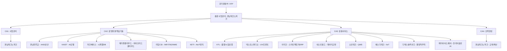
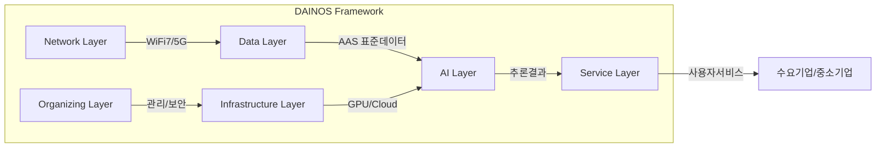

# 📋 사업계획서 심층 분석 보고서

## 「스마트그린 산업단지 제조산업 특화 초거대 제조 AI 서비스 개발 및 실증사업」
### 3차년도 (2026) 사업계획서 v2.0 분석

---

## 📌 1. 사업 개요 (Executive Summary)

| 항목 | 내용 |
|------|------|
| **사업명** | 스마트그린 산업단지 제조산업 특화 초거대 제조 AI 서비스 개발 및 실증 |
| **총 사업기간** | 2024.05.01 ~ 2026.12.31 (32개월) |
| **3차년도** | 2026.01.01 ~ 2026.12.31 (12개월) |
| **주관기관** | 경남테크노파크 |
| **참여기관** | 14개 기관 (총 15개 기관) |
| **수요기업** | KG모빌리티, 신성델타테크 |
| **핵심 프레임워크** | DAINOS (Data-AI-Infrastructure-Network-Organizing-Service) |
| **EBC 위치** | 경남대학교 한마미래관 1층 |

### 1.1 사업 비전 및 목표

경남 지역 제조산업 (자동차부품, 항공, 조선, 방산 등)에 특화된 **초거대 제조AI** 플랫폼을 구축하여:
- **제조 데이터 표준화**: IEC-63278 AAS 기반 제조데이터 자산관리
- **초거대 AI 적용**: LLM + 멀티모달 + 도메인 특화 AI
- **실증 및 확산**: 수요기업 실증 → 지역 중소제조기업 확산

### 1.2 연차별 로드맵

```
1차년도 (2024): 기반 구축 - 인프라, 데이터 수집체계, 기초 AI 모델
2차년도 (2025): 고도화 - 서비스 연동, AI 모델 확장, 보안 강화  
3차년도 (2026): 통합 완성 - MoE 통합모델, 서비스 상용화, 성과 확산
```

---

## 📌 2. 추진 체계 분석

### 2.1 조직 구조



### 2.2 참여기관별 역할 요약

| # | 기관명 | 역할 | 핵심 기술/기여 |
|---|--------|------|---------------|
| 1 | **경남테크노파크** | 총괄/사업관리 | PM, 사업관리, EBC 운영, 인력양성 |
| 2 | **KTL (한국산업기술시험원)** | 품질/시험인증 | 시험인증 AI, 품질관리 |
| 3 | **경남대학교** | 핵심기술 | AAS 표준화, 보안, 인프라 |
| 4 | **KAIST** | 핵심기술 | MoE 통합 AI 모델, LLM |
| 5 | **넥스트스튜디오** | 응용서비스 | UX/UI, 프론트엔드, 시각화 |
| 6 | **메가존클라우드** | 핵심기술 | 하이브리드 클라우드, GCP, MLOps |
| 7 | **마크베이스** | 핵심기술 | 시계열DB (200만건/초), 에지컴퓨팅 |
| 8 | **아미크** | 응용서비스 | 스마트팩토리 ERP, 데이터 파이프라인 |
| 9 | **네스트필드** | 응용서비스 | EDC 기반 기업간 데이터 교환 |
| 10 | **소르테크** | 응용서비스 | QMS, sLM Agent, ESG 규제대응 |
| 11 | **에스디테크** | 응용서비스 | IIoT 센서, 데이터 수집 |
| 12 | **디엑스솔루션즈** | 응용서비스 | 불량 역추적, MES 연동 |
| 13 | **메타아이스퀘어** | 응용서비스 | 한국어 음성인식 AI |
| 14 | **라임CSI** | 핵심기술 | WiFi 7, 5G 특화망, NMS |
| 15 | **KETI (전자기술연구원)** | 핵심기술 | AIoT 엣지 컴퓨팅 |

### 2.3 프로젝트 관리 방법론

- **PMBOK / ISO 21500** 기반 프로젝트 관리
- **시스템엔지니어링 (SE) / ISO 15288** 기반 기술개발 관리
- **4개 Control Account (CA)** 기반 WBS 구조
- **EVM (Earned Value Management)** 성과 측정

---

## 📌 3. 기술 아키텍처 심층 분석

### 3.1 DAINOS 프레임워크

DAINOS는 이 사업의 핵심 기술 프레임워크로 6개 도메인으로 구성됩니다:



| 도메인 | 핵심 기술 | 담당 기관 |
|--------|----------|----------|
| **Data** | AAS 표준화, 시계열DB, IIoT 수집, EDC 교환 | 경남대, 마크베이스, 에스디테크, 네스트필드 |
| **AI** | MoE LLM, sLM Agent, 멀티모달, 음성AI, 결함검출 | KAIST, 소르테크, 메타아이스퀘어, 디엑스솔루션즈 |
| **Infrastructure** | 하이브리드 클라우드, On-premise GPU, MLOps | 메가존클라우드, 경남대 |
| **Network** | WiFi 7, 5G 특화망, NMS | 라임CSI |
| **Organizing** | PM, 보안, 품질관리, EBC | 경남테크노파크, KTL, 경남대 |
| **Service** | UX/UI, ERP, QMS, EBC 전시 | 넥스트스튜디오, 아미크, 소르테크 |

### 3.2 3차년도 핵심 기술 과제

#### 3.2.1 MoE (Mixture of Experts) 통합 제조 AI 모델 (KAIST)
- 1~2차년도 개별 AI 모델들을 **MoE 아키텍처**로 통합
- Expert 라우팅을 통한 도메인별 최적 모델 선택
- 제조 도메인 특화 LLM 파인튜닝

#### 3.2.2 AAS Infer-Repository (경남대)
- **Knowledge Graph** 기반 제조데이터 온톨로지
- IEC-63278 AAS 표준 준수
- IDTA 표준 Submodel 연동

#### 3.2.3 sLM Agent (소르테크)
- **RAG (Retrieval Augmented Generation)** 기반 품질관리 Q&A
- ESG 규제 대응 자동화
- Small Language Model로 경량화

#### 3.2.4 시계열 DB 고도화 (마크베이스)
- 목표: **200만건/초** 데이터 처리
- 에지 컴퓨팅 연동
- 실시간 제조 데이터 수집/저장

#### 3.2.5 하이브리드 클라우드 (메가존클라우드)
- On-premise (경남대 GPU 서버) + GCP 클라우드
- MLOps 파이프라인 구축
- AI DevOps 자동화

#### 3.2.6 WiFi 7 / 5G 특화망 (라임CSI)
- 공장 내 차세대 무선통신 인프라
- NMS (Network Management System) 통합 관리
- 저지연 고대역폭 제조현장 통신

#### 3.2.7 AIoT 엣지 컴퓨팅 (KETI)
- IoT 센서 + AI 추론을 엣지에서 실행
- 실시간 이상 감지
- 클라우드-엣지 연동

### 3.3 기술 스택 요약

```
┌─────────────────────────────────────────────────────┐
│                   Service Layer                      │
│  UX/UI · ERP · QMS · EBC 전시 · 불량역추적           │
├─────────────────────────────────────────────────────┤
│                    AI Layer                           │
│  MoE LLM · sLM Agent · 멀티모달 · 음성AI · RAG      │
├─────────────────────────────────────────────────────┤
│                   Data Layer                         │
│  AAS 표준 · 시계열DB · EDC · Knowledge Graph         │
├─────────────────────────────────────────────────────┤
│               Infrastructure Layer                   │
│  하이브리드클라우드 · GPU서버 · GCP · MLOps          │
├─────────────────────────────────────────────────────┤
│                 Network Layer                        │
│  WiFi 7 · 5G특화망 · NMS · IIoT                     │
├─────────────────────────────────────────────────────┤
│               Security & Management                  │
│  AAS보안 · PM · 품질관리 · EVM                       │
└─────────────────────────────────────────────────────┘
```

---

## 📌 4. WBS (Work Breakdown Structure) 분석

### 4.1 4대 Control Account 구조

| CA | 명칭 | 비중 | 핵심 내용 |
|----|------|------|----------|
| **CA1** | 사업관리 | ~8% | PM, 성과관리, 보안, 기술이전 |
| **CA2** | 운영환경/핵심기술 | ~45% | DAINOS 핵심 기술 개발 |
| **CA3** | 응용서비스 | ~40% | 실증, 서비스 개발, 수요기업 적용 |
| **CA4** | 인력양성 | ~7% | 교육, EBC 운영, 확산 |

### 4.2 3차년도 핵심 단위과제

**CA2 - 운영환경/핵심기술:**
- 2.1 AAS 기반 디지털트윈 고도화 및 보안 통합
- 2.2 MoE 통합 제조 AI 모델 개발
- 2.3 시계열DB 200만건/초 처리 고도화
- 2.4 하이브리드 클라우드 MLOps 완성
- 2.5 WiFi 7 / 5G NMS 통합
- 2.6 AIoT 엣지 컴퓨팅 실증

**CA3 - 응용서비스:**
- 3.1 스마트팩토리 ERP-AI 연동
- 3.2 EDC 기업간 데이터 교환 서비스
- 3.3 sLM Agent 기반 QMS
- 3.4 IIoT 데이터 수집 고도화
- 3.5 AI 기반 불량 역추적
- 3.6 한국어 음성인식 현장 적용
- 3.7 시험인증 AI 서비스

**CA4 - 인력양성:**
- 4.1 제조AI 전문인력 교육과정 운영
- 4.2 EBC 운영 및 기업 확산

---

## 📌 5. 예산 분석

### 5.1 총 사업비 구조 (3개년)

| 구분 | 금액 | 비율 |
|------|------|------|
| **정부출연금** | ~150억원 | 65.4% |
| **지방비** | ~65억원 | 28.3% |
| **민간부담금** | ~14.4억원 | 6.3% |
| **합계** | **~229.4억원** | 100% |

### 5.2 3차년도 예산 (수정 기준)

| 구분 | 금액 |
|------|------|
| **정부출연금** | 62억원 |
| **지방비 현금** | 29억원 |
| **민간 현금** | 6.35억원 |
| **민간 현물** | 5.715억원 |
| **3차년도 합계** | **~97.35억원** |

### 5.3 기관별 3차년도 예산 비중 (추정)

주요 예산 항목:
- **인건비**: 가장 큰 비중 (약 40-50%)
- **시설장비비**: GPU 서버, 네트워크 장비 등
- **재료비**: 센서, IoT 디바이스 등
- **연구활동비**: 출장, 학회, 기술자문
- **간접비**: 관리비, 간접경비

### 5.4 해외출장 계획 (3차년도)

| 행사 | 장소 | 목적 |
|------|------|------|
| **CKC 2026** | 캐나다 | 한캐 과학기술 컨퍼런스 |
| **IETF 125/126** | 해외 | 인터넷 표준화 |
| **GTC 2026** | 미국 (NVIDIA) | GPU/AI 컨퍼런스 |
| **HANNOVER MESSE** | 독일 | 제조/산업 박람회 |
| **IDTA TechDays** | 독일 | AAS 표준화 |
| **Google Cloud Next** | 미국 | 클라우드 기술 |
| **AWS re:Invent** | 미국 | 클라우드/AI |
| **COOL Chips** | 일본 | 반도체/AI칩 |
| **IEEE INDIN** | 해외 | 산업정보학 |

---

## 📌 6. 성과지표 (KPI) 분석

### 6.1 공통 성과지표

| 지표 | 목표 | 측정 방법 |
|------|------|----------|
| **시스템 구축율** | 100% | 계획 대비 실적 |
| **장비 가동률** | 95% 이상 | 가동시간/총시간 |
| **기업 지원 수** | 목표 기업 수 달성 | 실증+확산 기업 수 |
| **교육 수료생** | 목표 인원 달성 | 교육과정 수료자 |

### 6.2 기관별 특화 성과지표

| 기관 | 핵심 KPI | 목표치 |
|------|---------|--------|
| **마크베이스** | 시계열DB 처리속도 | 200만건/초 |
| **KAIST** | MoE 모델 정확도 | 기준 대비 향상율 |
| **라임CSI** | WiFi 7 전송속도/안정성 | 목표 대역폭 달성 |
| **소르테크** | sLM Agent 응답 정확도 | RAG 기반 정확도 |
| **에스디테크** | IIoT 데이터 수집률 | 수집 안정성 |
| **디엑스솔루션즈** | 불량 역추적 정확도 | 검출률 |
| **메타아이스퀘어** | 한국어 음성인식률 | 인식 정확도 |

### 6.3 정량적 성과 목표

- **논문**: SCI/KCI 논문 발표
- **특허**: 국내외 특허 출원/등록
- **기술이전**: 참여기업 → 수요기업 기술이전
- **사업화**: 실증 결과 기반 상용화
- **인력양성**: 교육과정 수료 및 취업 연계

---

## 📌 7. 강점 분석 (Strengths)

### 7.1 기술적 강점
1. **DAINOS 프레임워크의 체계성**: 6개 도메인이 유기적으로 연결된 잘 설계된 아키텍처
2. **국제 표준 준수**: IEC-63278 AAS, IDTA 표준 적극 채택으로 글로벌 호환성 확보
3. **MoE 아키텍처 채택**: 최신 AI 트렌드 반영, 도메인별 전문가 모델 통합
4. **하이브리드 클라우드**: On-premise + GCP의 유연한 인프라 구성
5. **WiFi 7 + 5G**: 차세대 공장 통신 인프라의 선제적 도입

### 7.2 사업 구조적 강점
1. **산학연 협력 체계**: KAIST (학), KTL/KETI (연), 다수 기업 (산)의 균형 잡힌 구성
2. **수요기업 확보**: KG모빌리티, 신성델타테크 등 대형 수요기업 참여
3. **지역 특화**: 경남 제조산업 집적지의 지리적 이점 활용
4. **EBC 구축**: 경남대학교 내 물리적 전시/교육 공간 확보
5. **체계적 PM**: PMBOK/ISO 21500 + SE/ISO 15288 이중 관리체계

### 7.3 정책적 강점
1. **정부 정책 정합성**: 디지털 뉴딜, AI 국가전략, 스마트제조 정책과 부합
2. **지자체 연계**: 경남도 + 창원시 지방비 매칭으로 지역 관심 확보
3. **표준화 기여**: IDTA, IETF 등 국제 표준화 활동 병행

---

## 📌 8. 약점 및 리스크 분석 (Weaknesses & Risks)

### 8.1 구조적 약점

| # | 약점 | 영향도 | 설명 |
|---|------|--------|------|
| 1 | **참여기관 과다 (15개)** | 🔴 높음 | 15개 기관 간 의사소통/조율 비용 증가, 통합 리스크 |
| 2 | **기관별 소규모 예산 분산** | 🔴 높음 | 97억을 15개 기관에 분배 시 기관당 평균 6.5억으로 개별 성과 제한 |
| 3 | **수요기업 의존성** | 🟡 중간 | KG모빌리티, 신성델타테크 2개사에 실증이 집중 |
| 4 | **3차년도 통합 부담** | 🔴 높음 | 1-2차년도 개별 개발물의 3차년도 통합은 항상 고위험 |

### 8.2 기술적 리스크

| # | 리스크 | 가능성 | 대응방안 |
|---|--------|--------|---------|
| 1 | **MoE 모델 통합 실패** | 중간 | KAIST의 역량에 크게 의존, 단계적 통합 필요 |
| 2 | **AAS 표준 적용 한계** | 중간 | 실제 제조현장의 레거시 시스템과 AAS 호환성 |
| 3 | **200만건/초 DB 성능** | 낮음 | 마크베이스 고유 기술이나 실환경 검증 필요 |
| 4 | **WiFi 7 장비 수급** | 중간 | 2026년 기준 WiFi 7 상용 장비 가용성 |
| 5 | **보안 위협** | 중간 | 제조 OT + IT 융합 시 보안 취약점 증가 |
| 6 | **데이터 품질** | 높음 | 중소기업 제조데이터의 비정형성, 결측값 |

### 8.3 실행 리스크

| # | 리스크 | 가능성 | 설명 |
|---|--------|--------|------|
| 1 | **인력 이탈** | 중간 | 32개월 장기 사업으로 핵심인력 이직 가능성 |
| 2 | **일정 지연** | 높음 | 15개 기관 동시 진행으로 병목 발생 가능 |
| 3 | **기술 연동 실패** | 중간 | 이기종 시스템 간 인터페이스 불일치 |
| 4 | **수요기업 협조 부족** | 낮음 | 제조현장 접근 제한, 데이터 공유 꺼림 |

---

## 📌 9. 핵심 관찰 및 인사이트

### 9.1 사업의 독특한 포지셔닝

이 사업은 단순한 AI 개발 사업이 아닌, **제조업 + AI + 표준화 + 인프라 + 인력양성**을 동시에 추구하는 **통합형 메가 프로젝트**입니다. 이는 강점이자 동시에 리스크입니다.

### 9.2 AAS 표준의 전략적 가치

IEC-63278 AAS 표준을 핵심에 배치한 것은 **매우 선견지명적**입니다:
- 유럽 (특히 독일 Industry 4.0)에서 표준으로 자리잡는 중
- IDTA TechDays 참여로 표준화 기관과 직접 교류
- 한국 제조업의 글로벌 경쟁력 확보에 필수

### 9.3 MoE 아키텍처의 적절성

3차년도에 MoE로 통합하는 전략은 기술적으로 타당합니다:
- 1-2차년도: 개별 도메인 Expert 모델 개발
- 3차년도: Router + Expert 통합으로 범용 제조AI 완성
- GPT-4, Mixtral 등 최신 LLM이 MoE를 채택하는 추세와 일치

### 9.4 예산 효율성 우려

총 229억 규모에서:
- 15개 기관 분배로 인한 **분산 비효율**
- 해외출장 9건은 과다할 수 있음 (특히 IETF, COOL Chips 등은 사업 직접 관련성 의문)
- 인건비 비중이 높아 실제 기술개발 투자 비율 확인 필요

### 9.5 실증 확산의 현실성

- 수요기업 2개사 (KG모빌리티, 신성델타테크)에서의 실증은 적절
- 그러나 이를 **일반 중소기업으로 확산**하는 것은 별도의 큰 과제
- EBC를 통한 전시/교육은 인지도 제고에 도움이나, 실제 도입 장벽 (비용, 인력, 인프라)은 별개

### 9.6 인력양성 연계

- 경남대학교 기반 인력양성은 지역 정착에 유리
- 그러나 제조AI 분야의 고급 인력은 수도권/해외 유출 가능성 높음
- 교육과정의 **실무 연계성** 확보가 관건

---

## 📌 10. 종합 평가

### 10.1 SWOT 매트릭스

```
┌──────────────────────────────┬──────────────────────────────┐
│         Strengths            │         Weaknesses           │
│                              │                              │
│ · DAINOS 체계적 프레임워크    │ · 15개 기관 조율 복잡성       │
│ · AAS 국제표준 선제 채택      │ · 예산 분산으로 집중도 저하   │
│ · 산학연 균형 잡힌 컨소시엄   │ · 3차년도 통합 리스크         │
│ · 수요기업 참여 확보          │ · 수요기업 2개사 한정         │
│ · 하이브리드 클라우드 유연성  │ · 해외출장 과다 우려          │
├──────────────────────────────┼──────────────────────────────┤
│        Opportunities         │          Threats             │
│                              │                              │
│ · 제조AI 시장 급성장          │ · 글로벌 AI 기술 변화 속도    │
│ · 정부 스마트제조 정책 확대   │ · 중소기업 디지털 전환 저항   │
│ · AAS 글로벌 표준화 흐름      │ · 인력 수급 경쟁 심화         │
│ · 경남 제조업 클러스터 활용   │ · 유사 사업과의 차별화        │
│ · MoE/LLM 기술 성숙          │ · 사업 종료 후 지속가능성     │
└──────────────────────────────┴──────────────────────────────┘
```

### 10.2 종합 점수 (5점 만점)

| 평가 항목 | 점수 | 비고 |
|-----------|------|------|
| 기술 혁신성 | ⭐⭐⭐⭐ (4/5) | MoE, AAS, WiFi 7 등 최신 기술 적극 도입 |
| 사업 타당성 | ⭐⭐⭐⭐ (4/5) | 정책 부합, 지역 수요 존재 |
| 실행 가능성 | ⭐⭐⭐ (3/5) | 15개 기관 통합 관리의 현실적 어려움 |
| 예산 효율성 | ⭐⭐⭐ (3/5) | 분산 투자로 인한 비효율 우려 |
| 성과 지속성 | ⭐⭐⭐ (3/5) | 사업 종료 후 운영/유지 계획 보완 필요 |
| 확산 가능성 | ⭐⭐⭐ (3/5) | 중소기업 확산 전략 구체화 필요 |
| **종합** | **⭐⭐⭐½ (3.5/5)** | 기술적 야심은 높으나 실행 리스크 관리 필요 |

---

## 📌 11. 권고사항

### 11.1 즉시 조치 사항
1. **통합 테스트 계획 조기 수립**: 15개 기관 산출물 통합을 위한 Integration Test Plan 즉시 작성
2. **인터페이스 명세서 확정**: 기관 간 데이터/API 인터페이스 사양 조기 동결
3. **리스크 관리 강화**: 월 1회 리스크 리뷰 보드 운영

### 11.2 중기 개선 사항
1. **수요기업 확대**: 2개사 외 추가 수요기업 확보로 실증 다양성 확보
2. **해외출장 최적화**: 사업 직접 관련성이 낮은 출장 축소
3. **오픈소스 전략**: 핵심 기술의 오픈소스화를 통한 커뮤니티 형성 검토

### 11.3 장기 전략
1. **사업 종료 후 운영 모델**: EBC 및 플랫폼의 지속 운영을 위한 수익 모델 수립
2. **타 지역 확산**: 경남 성공 모델의 타 스마트산단 확산 로드맵
3. **글로벌 진출**: AAS 표준 기반 해외 제조기업 대상 서비스 수출 검토

---

*분석 완료일: 2026-03-26*
*분석 대상: 사업계획서 v2.0 (2026.01.21)*
*분석 범위: 전체 18,453줄 전문*
